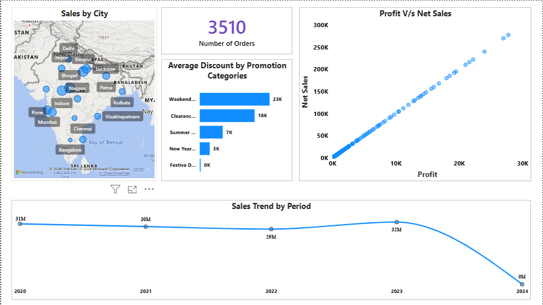
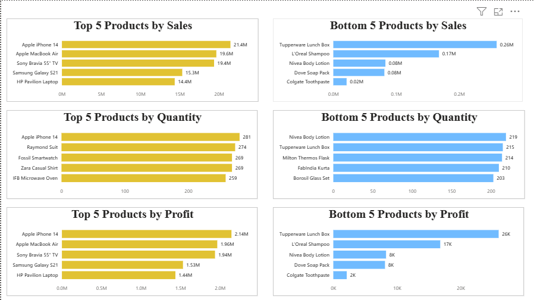
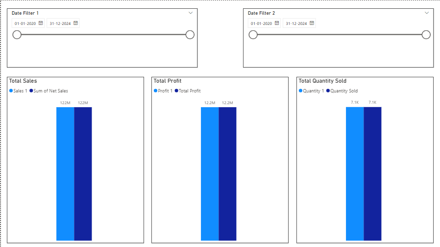
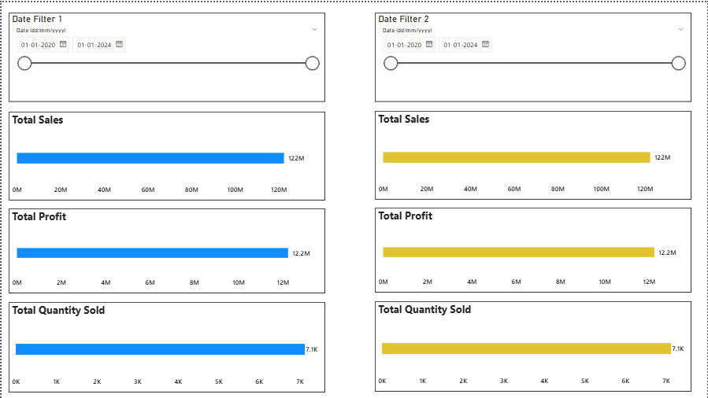
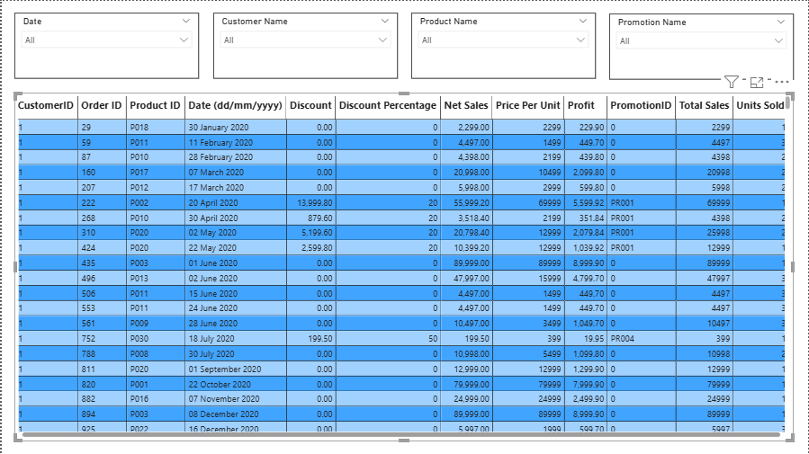

# Sales Analytics Dashboard — Power BI

An interactive Power BI dashboard analyzing sales, profit, and quantity trends using a star schema data model and DAX-driven time intelligence.

## 📌 Problem Statement

Businesses need a clear, interactive view of sales performance across products, regions, and time periods to make informed decisions. This dashboard consolidates sales, profit, and quantity data into a single interactive report, enabling quick identification of top/bottom performers and period-over-period trends.

## 🛠️ Tech Stack

- **Power BI Desktop**
- **DAX** (Data Analysis Expressions)
- **Power Query** — data transformation
- **Star Schema** data modeling

## 🗂️ Data Model

- Built using a **star schema** with a central Fact table connected to dimension tables (Product, Region, etc.)
- Includes a dedicated **Calendar Table** to support time intelligence functions
- Relationships modeled for clean drill-through and cross-filtering across visuals

## 📐 Key DAX Measures

- `CALCULATE`, `SUMX` for dynamic aggregations
- `ALL`, `ALLSELECTED`, `ALLEXCEPT` for context-aware calculations
- `DIVIDE` for safe ratio/percentage calculations
- Time intelligence: `TOTALMTD`, `TOTALQTD`, `SAMEPERIODLASTYEAR`

## 🔎 Step-by-Step Breakdown

### 1. Data Preparation (Power Query)
- Imported raw sales data into Power BI and reviewed for inconsistencies
- Cleaned and transformed columns using Power Query Editor (data types, renaming, removing unnecessary columns)
- Split data into logical Fact and Dimension tables to support a star schema design

### 2. Data Modeling
- Designed a **star schema** with a central Fact table (Sales) connected to dimension tables (Product, Region, Customer, etc.)
- Built a dedicated **Calendar Table** using DAX (`CALENDARAUTO()` / custom date table) to enable proper time intelligence
- Defined relationships between Fact and Dimension tables (1-to-many, single direction filtering)
- Verified relationship cardinality to avoid ambiguous filter paths

### 3. DAX Measures
- Built core aggregation measures using `SUM`, `SUMX`, and `CALCULATE` for Sales, Profit, and Quantity
- Used `DIVIDE` for safe ratio calculations (e.g., Profit Margin %) to avoid divide-by-zero errors
- Applied `ALL`, `ALLSELECTED`, and `ALLEXCEPT` to control filter context for comparisons (e.g., % of total sales)
- Added time intelligence measures — `TOTALMTD`, `TOTALQTD`, `SAMEPERIODLASTYEAR` — to compare performance across time periods

### 4. Report Page Design

**a) Overview Page**
- Built KPI cards for total Sales, Profit, and Quantity
- Added summary visuals (bar/line charts) for a quick health-check of overall performance

**b) Top/Bottom 5 Analysis Page**
- Created ranked visuals (bar charts/tables) to surface the top 5 and bottom 5 performing products or regions
- Used DAX ranking logic (`RANKX`) to dynamically identify top/bottom performers

**c) Comparison — Sales/Profit/Quantity Page**
- Built side-by-side visuals comparing Sales, Profit, and Quantity trends
- Enabled cross-filtering so selecting one visual filters related visuals on the same page

### 5. Interactivity & Navigation
- Set up **drill-through** pages so users can click a summary visual and jump to a detailed view
- Configured **Edit Interactions** to control how visuals filter or highlight each other across the report
- Added slicers (Category, Region, Date) for user-driven filtering

### 6. Troubleshooting & Fixes
- Resolved a date hierarchy disappearance issue caused by `CALENDARAUTO()` conflicting with the custom Calendar Table
- Fixed drill-up navigation behavior between summary and detail pages to ensure smooth back-and-forth navigation

## 📊 Report Pages

### 1. Overview
High-level summary of overall sales, profit, and quantity performance with key KPIs at a glance.



### 2. Top/Bottom 5 Analysis
Highlights the top 5 and bottom 5 performing products/regions to quickly surface strong and weak performers.



### 3. Comparison — Sales/Profit/Quantity
Side-by-side comparison view to analyze the relationship between sales volume, profitability, and quantity sold.



### 4. Edit Interactions
Configures how visuals filter, highlight, or cross-affect one another when a user clicks on a data point — used to fine-tune the interactive behavior across report pages.



### 5. Table Visual
A detailed tabular view of the underlying sales data, allowing users to inspect granular records alongside the summary visuals.



> 🖼️ *Dashboard screenshots to be added — see note below.*

## ✨ Features

- Drill-through navigation between summary and detail pages
- Interactive slicers and cross-filtering across visuals
- Time intelligence comparisons (MTD, QTD, YoY)

## 📁 Project Structure

```
├── Project_1_-_Sales_Data_Analysis.pbix   # Power BI report file
└── README.md
```

## 🚀 How to Run

1. Clone/download the repository
2. Open `Project_1_-_Sales_Data_Analysis.pbix` in **Power BI Desktop** (free download from Microsoft)
3. Explore the report pages using the tabs at the bottom

## 🖼️ Adding Dashboard Screenshots

GitHub doesn't render `.pbix` files as previews. To make this project easier to evaluate at a glance, add screenshots of each page:

1. Open the report in Power BI Desktop
2. Capture each page (Overview, Top/Bottom 5, Comparison) using Snipping Tool or **File → Export → Export to PDF**
3. Save as `.png` files in an `/images` folder in this repo
4. Reference them here like:
   ```markdown
   
   
   
   ```

## 👤 Author

**Pawan Solanke**
Data Analyst | SQL, Python, Power BI
